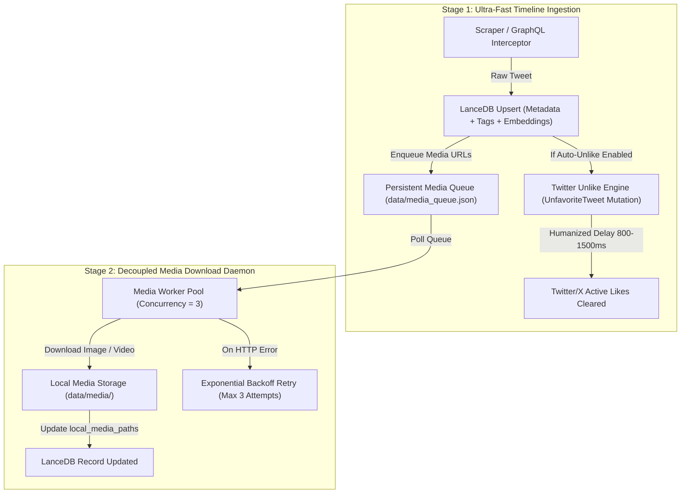

# Implementation Plan: Auto-Unlike on X & Decoupled 2-Stage Media Queue

## Overview
This plan defines the architectural specification for:
1. **Auto-Unlike & Remote Cleanup on Twitter/X**: After a tweet's full metadata is safely stored in local LanceDB, automatically or manually unliking the tweet on Twitter/X (`UnfavoriteTweet` mutation) so Twitter's active likes list remains pristine while the local database retains 100% of historical likes forever.
2. **Decoupled 2-Stage Ingestion Pipeline**:
   - **Stage 1 (Ultra-Fast Text, Embedding, Tagging & Unlike)**: Scrapes tweets, records media URLs, tags, embeds, persists to LanceDB, queues media tasks, and optionally unlikes on X in ~50ms/tweet.
   - **Stage 2 (Autonomous Async Media Download Worker)**: A decoupled background queue daemon that processes pending image/video downloads with concurrency limits, retry backoff, and state persistence in `data/media_queue.json`.

---

## Architectural Architecture Diagram



---

## Component Specifications

### 1. Twitter Unlike Engine (`src/ingestion/unliker.py`)
- **GraphQL Endpoint**: `POST https://x.com/i/api/graphql/{UNFAVORITE_QUERY_ID}/UnfavoriteTweet`
- **Fallback Playwright Action**: Click `div[data-testid='unlike']` on tweet article if GraphQL returns 404/403.
- **Safety Safeguards**:
  - **Opt-in setting**: `auto_unlike_on_ingest: bool` in `data/sync_state.json` (Default: `False` until user toggles ON).
  - **Transaction confirmation**: Only triggers unlike AFTER LanceDB upsert returns success.
  - **Pacing**: Randomized 800ms–1500ms sleep between unlike calls + pause on HTTP 429.
  - **Manual Bulk Action**: REST endpoint `POST /api/maintenance/unlike-synced` to clean up existing 280+ indexed likes in batches.

---

### 2. Decoupled Media Queue (`src/media/media_queue.py`)
- **Queue State Storage**: `data/media_queue.json`
  ```json
  {
    "pending": [
      {
        "tweet_id": "18958291823",
        "url": "https://pbs.twimg.com/media/xyz.jpg",
        "attempts": 0,
        "created_at": "2026-08-30 09:15:00"
      }
    ],
    "completed_count": 262,
    "failed": []
  }
  ```
- **Async Daemon Worker (`MediaQueueWorker`)**:
  - Runs in the background of FastAPI lifespan.
  - Concurrency: Up to 3 parallel downloads via `asyncio.Semaphore(3)`.
  - On download success: Automatically patches the tweet's `local_media_paths` column in LanceDB.
  - Resume capability: Survives server restarts without re-downloading existing media files.

---

### 3. Web Dashboard UI Additions (`src/server/app.py`)
1. **Header Unlike Toggle**:
   - `Auto-Unlike: ON / OFF` toggle switch with tooltip explanation: *"Unlikes tweets on X after indexing locally so your X likes list stays clean"*.
2. **Media Queue Status Indicator**:
   - Small live badge next to media stat: `Media Files: 262 (Queue: 0 pending)` that shows live background download activity.
3. **Manual Bulk Clean Modal**:
   - "Clean X Likes" button with confirmation prompt: *"This will send unlike requests to X for all 287 locally-indexed likes at a safe pace (1 per second). Your local database will NOT be deleted."*

---

## Implementation Steps & Milestones

| Step | Module | File | Target Deliverable |
| :--- | :--- | :--- | :--- |
| **1** | Media Queue Core | `src/media/media_queue.py` | Queue manager with `data/media_queue.json` persistence, worker loop, and retry backoff. |
| **2** | Pipeline Decoupling | `src/ingestion/sync_pipeline.py` & `background_sync.py` | Separate immediate text indexing from media downloads by pushing to queue instead of inline download. |
| **3** | Unlike Engine | `src/ingestion/unliker.py` | GraphQL `UnfavoriteTweet` mutation + Playwright fallback with 800–1500ms safety pacing. |
| **4** | Server & Background Daemon | `src/server/app.py` | Register `MediaQueueWorker` in FastAPI lifespan, add `/api/unlike/*` and `/api/media-queue/*` endpoints. |
| **5** | Web Dashboard UI | `src/server/app.py` | Add Auto-Unlike toggle, Media Queue live counter, and Bulk Unlike dialog. |
| **6** | Unit & Integration Tests | `tests/test_unlike_and_queue.py` | Verify queue recovery across restarts, unlike safety guards, and decoupled pipeline speed. |
