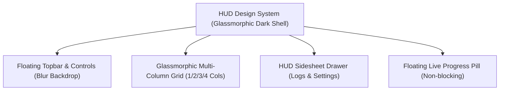

# 🛸 HUD UI/UX Reformat Plan: Twitter Likes Organizer

This plan outlines the reformatting of the **𝕏 Likes Organizer** web interface using design elements and tokens from the [`hud-design`](file:///home/aiserver/LABS/TWITTER/twitter-likes-organizer/hud-design) system.

---

## 1. Design Principles & Aesthetic Blueprint

### Core Design Elements:
1. **Glassmorphism & Depth**:
   - `background: rgba(14, 18, 28, 0.75);` with `backdrop-filter: blur(14px); -webkit-backdrop-filter: blur(14px);`
   - Glowing hairline borders: `border: 1px solid rgba(255, 255, 255, 0.08);`
   - Subtle cyan/primary ambient glow on active states: `box-shadow: 0 0 12px rgba(29, 155, 240, 0.25);`
2. **Typography & Monospace Elements**:
   - Inter / Roboto font family paired with monospace numerical readouts (`font-family: 'JetBrains Mono', 'Fira Code', monospace`) for sync tickers and statistics.
3. **Cybernetic Status Badges & Standardized Buttons**:
   - Translucent rounded badges (`.hud-badge`) for live Twitter connection and background worker health.
   - Standardized SVG action buttons (`.hud-btn`, `.hud-icon-btn`) inspired by `hud-design/static/css/standardized_buttons.css`.

---

## 2. Component Reformatting Roadmap

### Phase 1: Floating Glass HUD Topbar
- Replaces static header with a floating, sticky glassmorphic topbar:
  - **Left**: Neon Brand identity (`𝕏 LIKES ORGANIZER`) + Live Account Status pill.
  - **Center**: Real-time stats HUD ticker (`TOTAL: 3,328` | `MEDIA: 2,562` | `TAGS: 221` | `VECTORS: ON`).
  - **Right**: Unified Sync Pill (`Sync: ON [10m] Next: 04:12`), Auto-Unlike switch, and Quick Actions (`Sync Now`, `Logs`, `Export`).

### Phase 2: HUD Filter & Viewport Dock
- Floating translucent search capsule with instant vector semantic toggle.
- Horizontally scrollable neon tag cloud chips with glowing active state.
- Integrated SVG Layout Toolbar:
  - Column Grid Selector: `1 Col`, `2 Col`, `3 Col`, `4 Col`
  - Display Mode Selector: `Cards`, `Compact List`, `Gallery Grid`
  - Quick Sort Dropdown: `Newest First`, `Oldest First`, `Media Only`, `Author A-Z`

### Phase 3: Glassmorphic Tweet Cards & Media Gallery
- **Card View**: Translucent dark surfaces, rounded image containers, hover glow, and inline tag chips.
- **Compact List View**: High-density 1-liner HUD terminal rows with monospace authors and truncated text.
- **Gallery View**: Image-dominant showcase with hover captions and media badges.
- Native `loading="lazy"` with hybrid offline-first local file priority (`/media/...`) and CDN fallback.

### Phase 4: HUD Right Sidesheet (Replacing Heavy Modals)
- Slide-over right drawer (modeled after `hud_sidesheet.css`):
  - **Tab 1: Live Sync Logs** — Real-time telemetry, execution durations, and historical run data.
  - **Tab 2: Notification Center** — Status alerts and bulk unlike receipts with unread badges.
  - **Tab 3: Twitter Connection & Maintenance** — Cookie inspector and clean-likes utilities.

### Phase 5: Floating HUD Sync & Queue Toast
- Floating bottom-right widget (`.hud-toast`) with glowing circular spinner, percentage progress bar, and real-time streaming terminal log.

---

## 3. Submodule Rule Compliance
- As stipulated in `autonomous-coding-agents/AGENTS.md`, **files inside `hud-design/` will remain completely unmodified as read-only references**.
- The CSS styles, variables, and components will be served and integrated through `src/server/app.py` and application static assets.
